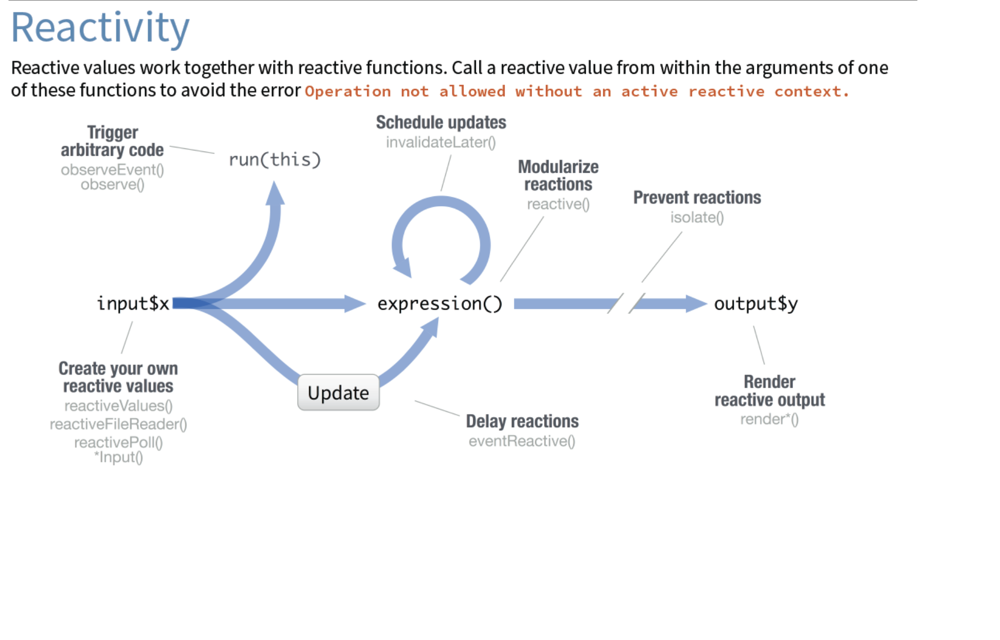

```{r setup, include=FALSE}
library(learnr)
library(ggplot2)
knitr::opts_chunk$set(echo = FALSE)
```

```{r}
learnr::initialize_tutorial()
```

```{r, context = "data", include = FALSE}
movies <- read.csv("www/movies.csv")
```

## More reactivity

{width="100%"}

- a reactive function without a reactive value does **not** work!
- a reactive value can come from `input$*`, `reactive()`, or `eventReactive()`
- using `input$*` vs. `reactive()` for reactive functions:
  - use `input$*` if the reactive value can be *directly* used by the reactive function
  - use `reactive()` if the `input$*` requires some processing  
  in order to generate what is needed for the reactive function

### &nbsp;

### Example with `input` and `reactive()`

**For example, you have an `input` value and want to report the square of the value you can use `reactive()` to create the square value and pass it to the reactive function**

<div class = "row">
<div class = "col-md-9">
```{r eval = FALSE, echo = TRUE}
# ui
numericInput(inputId = "number", label = NULL, value = 5)
textOutput(outputId = "input")
textOutput(outputId = "square")

# server
n <- reactive(input$number ^ 2) # computes the square of 'input$number'
output$input <- renderText(input$number) # directly uses 'input$number'
output$square <- renderText(n()) # uses reactive value 'n'        
```
</div>
<div class = "col-md-3">
```{r results = "hold", echo = FALSE}
numericInput(inputId = "number", label = NULL, value = 5)
textOutput(outputId = "input")
textOutput(outputId = "square")
```
```{r context = "server"}
n <- reactive(input$number^2)         
output$input <- renderText(input$number) 
output$square <- renderText(n())      
```
</div>
</div>

## Controlling Reactives

{width="100%"}

- reactive functions automatically update when reactive values change
- **control** reactivity with
(e.g., a plot/function shouldn't update each time an input changes)
  - `observeEvent` detects specific change
  - `eventReactive` creates a new variable based on some change  
  > both can be controlled by an `actionButton`

### &nbsp;

### Example
*Here's an example of a simple app with 2 plots:*  
*One using `renderPlot`, the other using `eventReactive`*

**Normal reactivity**
<div class = "row">
<div class = "col-md-3">
```{r}
sliderInput("bins", "Slider1", min = 1, max = 50, value = 30)
```
</div>
<div class = "col-md-9">
```{r plot1}
plotOutput("distPlot")
```
</div>
</div>

**Controlled reactivity**
<div class = "row">
<div class = "col-md-3">
```{r}
sliderInput("bins2", "Slider2", min = 1, max = 50, value = 30)
actionButton("button", "Refresh Slider2")
```
</div>
<div class = "col-md-9">
```{r plot2}
plotOutput("distPlot2")
```
</div>
</div>
```{r context="server"}
output$distPlot <- renderPlot({
  x <- faithful[, 2]  
  bins <- seq(min(x), max(x), length.out = input$bins + 1)
  hist(x, breaks = bins, col = 'darkgray', border = 'white')
})

df2 <- eventReactive(input$button,
                     input$bins2)

output$distPlot2 <- renderPlot({
  x <- faithful[, 2]  
  bins <- seq(min(x), max(x), length.out = df2() + 1)
  hist(x, breaks = bins, col = 'darkgray', border = 'white')
})
```

### The code to control reactivity

**Normal reactivity**
<div class = "row">
<div class = "col-md-5">
```{r eval = FALSE, echo = TRUE}
ui <- fluidPage(
  sliderInput(
    inputId = "bins1", 
    label = "Slider1", 
    min = 1, max = 50, 
    value = 30)
  plotOutput(
    outputId = "hist1"))
```
</div>
<div class = "col-md-7">
```{r eval = FALSE, echo = TRUE}
server <- function(input, output, session) {
  output$hist1 <- renderPlot({
    x <- faithful[, 2] 
    bins <- seq(min(x), max(x), 
      length.out = input$bins1 + 1)
    hist(x, 
      breaks = bins, 
      col = "darkgray", 
      border = "white")
  })
}
```
</div>
</div>

**Controlled reactivity**
<div class = "row">
<div class = "col-md-5">
```{r eval = FALSE, echo = TRUE}
ui <- fluidPage(
  sliderInput(
    inputId = "bins2", 
    label = "Slider2", 
    min = 1, max = 50, 
    value = 30),
  actionButton(
    inputId = "button", 
    label = "Refresh Slider2"),
  plotOutput(
    outputId = "hist2"))
```
</div>
<div class = "col-md-7">
```{r eval = FALSE, echo = TRUE}
server <- function(input, output, session) {
  n_bins <- eventReactive(
    eventExpr = input$button, 
    valueExpr = input$bins2)
  
  output$hist2 <- renderPlot({
    x <- faithful[, 2]
    bins <- seq(min(x), max(x), 
      length.out = n_bins() + 1)
    hist(x, 
      breaks = bins, 
      col = "darkgray", 
      border = "white")
  })
}
```
</div>
</div>

### Example with `eventReactive()` and `actionButton()`

**We can control if the reactive value is calculated by using `eventReactive` and the `actionButton`**

<div class = "row">
<div class = "col-md-9">
```{r eval = FALSE, echo = TRUE}
# ui
numericInput(inputId = "number2", label = NULL, value = 5)
actionButton("go", "square it")
textOutput(outputId = "input2")
textOutput(outputId = "square2")

# server
n2 <- eventReactive(input$go, {input$number2^2}) #waits for button press before creating the reactive
output$input2 <- renderText(input$number2) #can use input$number directly
output$square2 <- renderText(n2()) #uses reactive n 
```
</div>
<div class = "col-md-3">
```{r results = "hold", echo = FALSE}
numericInput(inputId = "number2", label = NULL, value = 5)
actionButton("go", "square it")
textOutput(outputId = "input2")
textOutput(outputId = "square2")
```

```{r context = "server"}
n2 <- eventReactive(input$go, {input$number2^2}) #waits for button press before creating the reactive
output$input2 <- renderText(input$number2) #can use input$number directly
output$square2 <- renderText(n2()) #uses reactive n 
```
</div>
</div>

## Tabsets

- Tabsets are useful for organizing the app into bite-size pieces
- Tabsets are also useful for controlling reactivity 
- Tabs are updated when clicked (useful for computationally expensive functions)

**In a normal case we would do this in shiny**

<div class = "row">
<div class = "col-md-3">
```{r}
numericInput("num", "Sample n numbers", min = 10, max = 1000, value = 100)
```
</div>
<div class = "col-md-9">
```{r}
textOutput("mean1")
textOutput("sd1")
plotOutput("plot1")
```
</div>
</div>
```{r, context = "server"}
x <- reactive({runif(input$num, 0, 100)})
output$mean1 <- renderText(paste("mean =", mean(x())))
output$sd1 <- renderText(paste("standard deviation =", sd(x())))
output$plot1 <- renderPlot(plot(density(x())))
```

### Regular shiny code
```{r, eval = FALSE, echo = TRUE}
ui <- fluidPage(
  sidebarLayout(
    sidebarPanel(numericInput("num", "Sample n numbers", min = 10, max = 1000, value = 100)),
    mainPanel(textOutput("mean1"),
              textOutput("sd1"),
              plotOutput("plot1")))
)

server <- function(input, output, session) {
  x <- reactive({runif(input$num, 0, 100)})
  output$mean1 <- renderText(paste("mean =", mean(x())))
  output$sd1 <- renderText(paste("standard deviation =", sd(x())))
  output$plot1 <- renderPlot(plot(density(x())))
}

shinyApp(ui, server)
```

### Tabset code

```{r, eval = FALSE, echo = TRUE}
ui <- fluidPage(
  sidebarLayout(
    sidebarPanel(numericInput("num", "Sample n numbers", min = 10, max = 1000, value = 100)),
    mainPanel(tabsetPanel(type = "tabs",
                          tabPanel("mean",textOutput("mean1")),
                          tabPanel("standard deviiation", textOutput("sd1")),
                          tabPanel("density plot", plotOutput("plot1")))
              )
    )
  )


server <- function(input, output, session) {
  x <- reactive({runif(input$num, 0, 100)})
  output$mean1 <- renderText(paste("mean =", mean(x())))
  output$sd1 <- renderText(paste("standard deviation =", sd(x())))
  output$plot1 <- renderPlot(plot(density(x())))
}

shinyApp(ui, server)
```